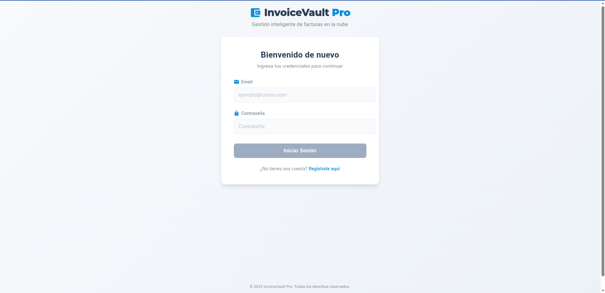
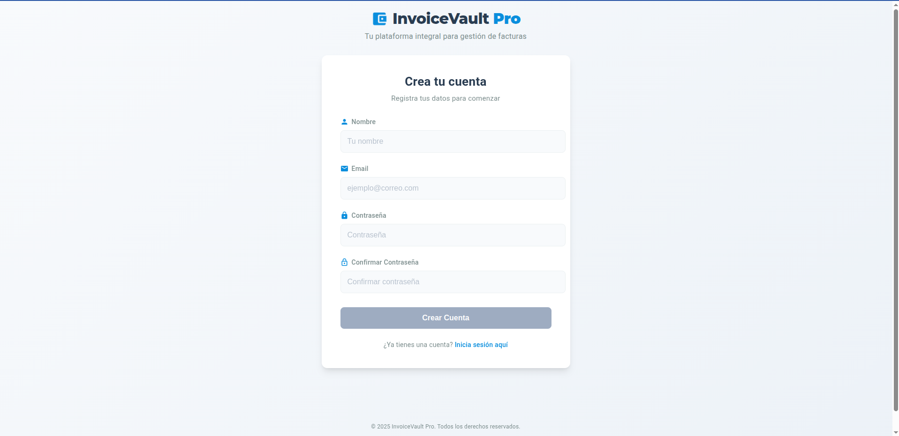
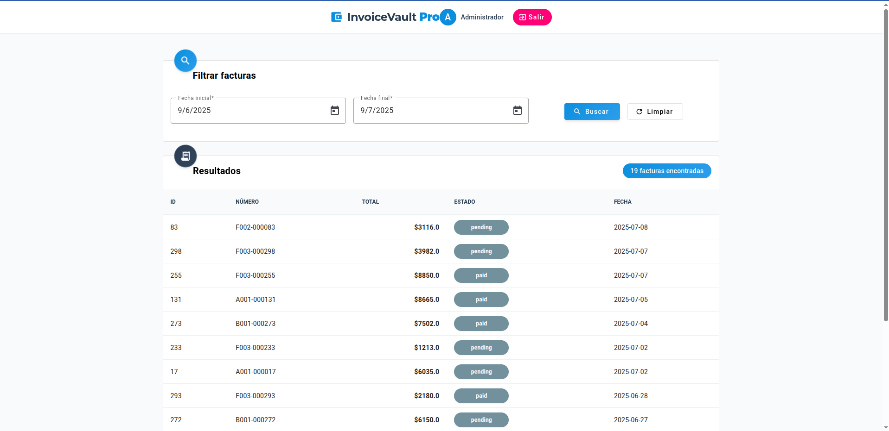
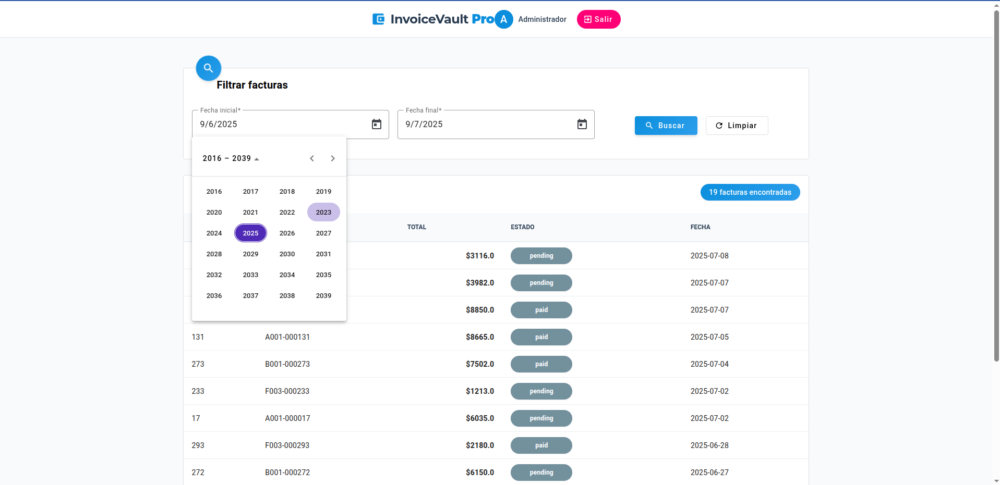
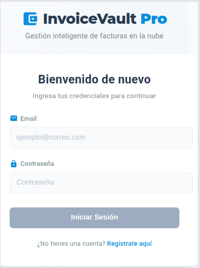
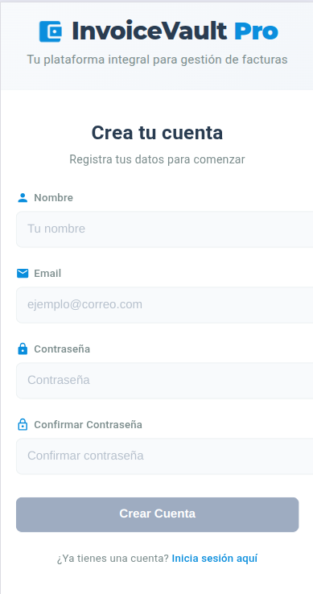
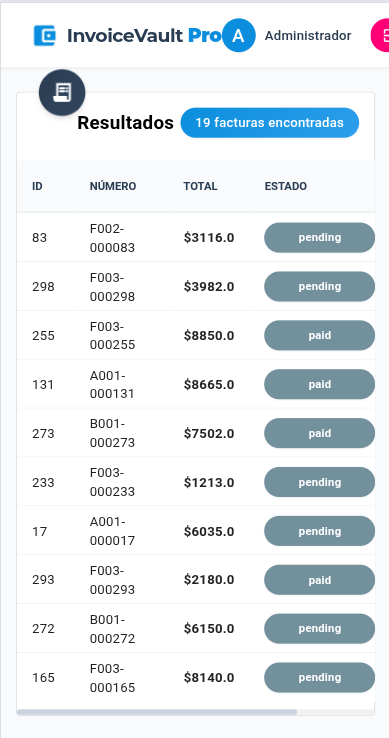
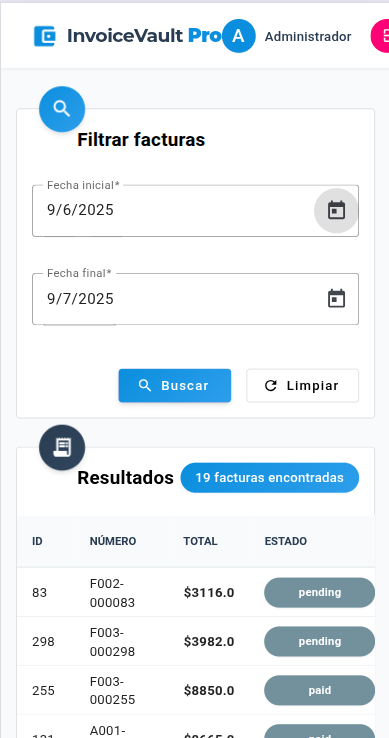

# 📊 InvoiceVault Pro

<div align="center">
  
  
  <p><em>Sistema de Gestión Inteligente de Facturas</em></p>

  [](https://angular.io/)
  [](https://www.typescriptlang.org/)
  [](https://material.angular.io/)
  [](LICENSE)
</div>

## 🌟 Características Principales

- **Autenticación Completa**: Sistema de login/registro/logout con almacenamiento seguro de tokens
- **Interfaz Moderna**: Diseño profesional con animaciones y transiciones fluidas
- **Búsqueda Avanzada**: Filtra facturas por fechas y otros criterios
- **Paginación Inteligente**: Navegación rápida por grandes conjuntos de datos
- **Diseño Responsive**: Experiencia optimizada en dispositivos móviles y escritorio
- **Protección de Rutas**: Sistema de guardas para acceso seguro a contenidos

## 📸 Capturas de Pantalla

<div align="center">
  <table>
    <tr>
      <td align="center">
        
        <br>
        <em>Inicio de Sesión</em>
      </td>
      <td align="center">
        
        <br>
        <em>Registro</em>
      </td>
    </tr>
    <tr>
      <td align="center">
        
        <br>
        <em>Gestión de Facturas</em>
      </td>
      <td align="center">
        
        <br>
        <em>Búsqueda</em>
      </td>
    </tr>
    <tr>
      <td align="center">
        
        <br>
        <em>Inicio de Sesión Mobile</em>
      </td>
      <td align="center">
        
        <br>
        <em>Registro Mobile</em>
      </td>
    </tr>
    <tr>
      <td align="center">
        
        <br>
        <em>Gestión de Facturas Mobile</em>
      </td>
      <td align="center">
        
        <br>
        <em>Búsqueda Mobile</em>
      </td>
    </tr>
  </table>
</div>

## 🚀 Comenzando

### Requisitos Previos

- **Node.js** v16 o superior
- **npm** o **Yarn**
- **Angular CLI** instalado globalmente:
  ```bash
  npm install -g @angular/cli
  ```

### ⚙️ Configuración del Entorno

Antes de ejecutar la aplicación, configura correctamente el entorno:

1. Crea o edita los archivos de entorno:

**`src/environments/environment.ts`**
```typescript
export const environment = {
  production: false,
  apiUrl: 'http://localhost:3000/api/v1',  // Dirección del backend (API)
};
```

**`src/environments/environment.development.ts`**
```typescript
export const environment = {
  production: false,
  apiUrl: 'http://localhost:3000/api/v1',
  clientId: 'frontend_app',
  apiKey: 'frontend_api_key'
};
```

### 📦 Instalación de Dependencias

```bash
# Con npm
npm install

# O con Yarn
yarn install
```

### 🖥️ Desarrollo Local

```bash
# Iniciar servidor de desarrollo
npm start
# o
yarn start

# La aplicación estará disponible en:
# http://localhost:4200
```

## 🏗️ Estructura del Proyecto

```
src/
├── app/
│   ├── components/         # Componentes reutilizables
│   │   ├── auth/           # Componentes de autenticación
│   │   ├── invoice-list/   # Lista de facturas
│   │   ├── invoice-search/ # Búsqueda de facturas
│   │   ├── layout/         # Estructura general de la aplicación
│   │   └── pagination/     # Componente de paginación
│   ├── guards/             # Guardas de rutas
│   ├── models/             # Interfaces y modelos
│   ├── pages/              # Páginas principales
│   └── services/           # Servicios para API y lógica
├── assets/                 # Recursos estáticos
└── environments/           # Configuraciones por entorno
```

## 🧪 Pruebas

```bash
# Ejecutar pruebas unitarias
npm test

# Ejecutar pruebas end-to-end
npm run e2e
```

## 📱 Compatibilidad

- ✅ Chrome, Firefox, Edge, Safari
- ✅ Dispositivos móviles y tablets (diseño responsive)
- ✅ Soporte para teclado y lectores de pantalla (accesibilidad)

## 🛠️ Construido Con

- [Angular 19](https://angular.io/) - Framework frontend
- [Angular Material](https://material.angular.io/) - Componentes de UI
- [RxJS](https://rxjs.dev/) - Programación reactiva
- [TypeScript](https://www.typescriptlang.org/) - Superset de JavaScript

## 📄 Licencia

Este proyecto está bajo la Licencia MIT - ver el archivo [LICENSE](LICENSE) para más detalles.

---

<div align="center">
  <p>
    <strong>InvoiceVault Pro</strong> - Desarrollado con ❤️ por el equipo de Contalink
  </p>
  <p>
    <a href="https://github.com/contalink">GitHub</a> •
    <a href="https://contalink.com">Sitio Web</a> •
    <a href="mailto:soporte@contalink.com">Contacto</a>
  </p>
</div>
